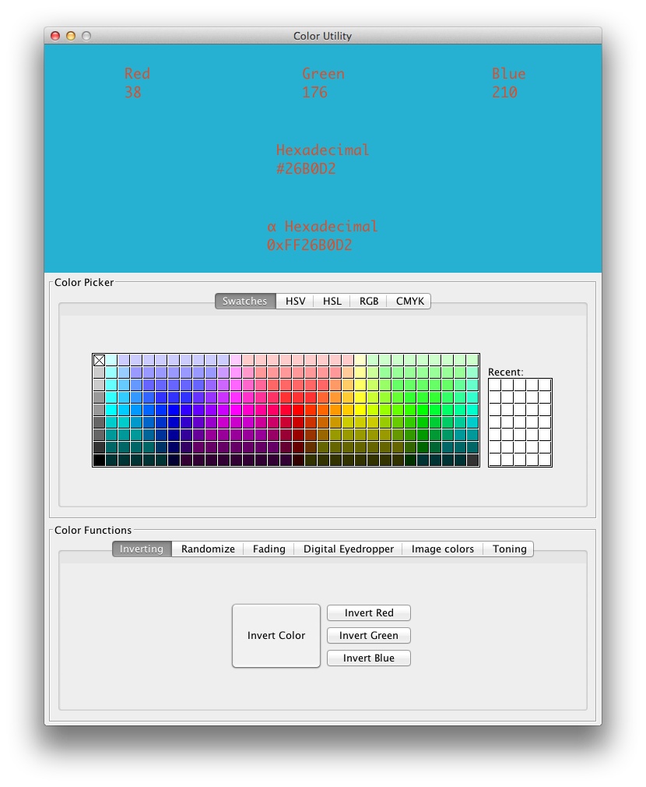

# Color Utility

Color Utility is a simple color tool for developers. It was developed for a contest ([제 30회 한국정보올림피아드](https://www.digitalculture.or.kr/sub06/InfoOlympiad.do)) where it won a silver medal.